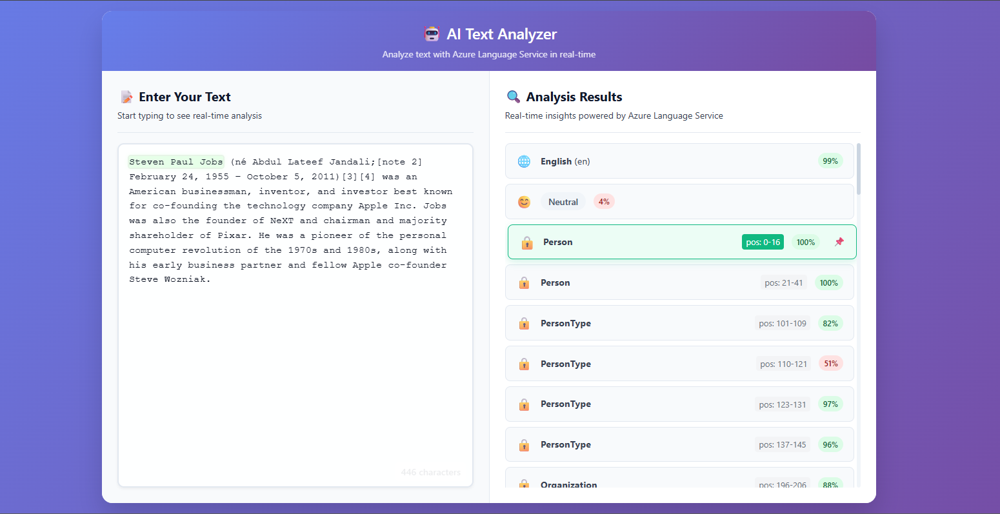

# AI Text Analyzer

Real-time text analysis using Azure Language Service with React frontend and FastAPI backend.

## What it does?

Analyzes text for:
- **Language detection** - identifies the language
- **Sentiment analysis** - positive/negative/neutral sentiment
- **PII entities** - finds personal information
- **Key phrases** - extracts important phrases
- **Entities** - detects names, places, organizations
- **Linked entities** - connects to external knowledge sources


## How to start?

### 1. Setup environment
Create `.env` file with your Azure credentials:
```bash
AZ_AI_RESOURCE_KEY=your-azure-key
AZ_AI_RESOURCE_ENDPOINT=your-azure-endpoint
```

### 2. Start the client
```bash
cd client
npm install
npm run dev
```

### 3. Start the server
```bash
cd server
conda create --name az-langsvc python=3.8
conda activate az-langsvc
pip install -r requirements.txt
uvicorn src.main:app --reload
```

### Using Docker
```bash
docker build -t ai-text-analyzer .
docker run -p 8000:8000 ai-text-analyzer
```

# Demo Screenshot
